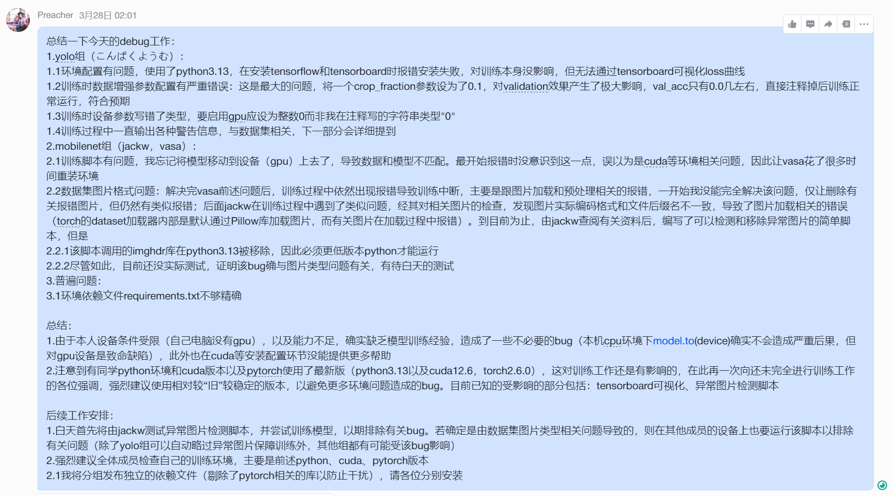

# 第二届百校天则后日谈

-   2025/04/08
-   Preacher 

活动已经过去有几天了，现在才来总结一下。趁着大部分记忆还没淡忘，尽可能多憋一些废话吧。

东方角色识别的点子很早就有了，对我来说响子识图就是一切的根源，很久以前玩到这个应用的时候拿来到处拍拍拍识别角色，就感觉很有意思。再后来，就在想能不能自己训练一个这样的模型，然后拿到摊位……拿到百校天则上！把一个类似响子识图的东方角色识别系统搬到百校天则学校摊位上，然后让游客们玩一玩，我相信这会是一个很有趣的体验。于是，在 3 月 8 号我们线下讨论百校天则活动事宜的时候，就向大家提出了这个点子。

## 数据集

当然，只有一个月不到的时间，要确保把东西做出来做好，还是挺有挑战性的。不过，真正向大伙提出这个计划之前，我还是稍微做了点初步预计的。比如，在线下讨论之前，就在网上尝试收集了一下数据集。[CyberHarem](https://huggingface.co/CyberHarem)，这是 huggingface 上一个集中存储动漫女角色图像数据集和 LoRA 模型的仓库，尽管本来的用途可能是图像生成模型的微调，但毫无疑问也能用于我们的分类任务。从该仓库中，我们收集了大约 50GB 的图像数据，涵盖约 130 个东方角色，不过数量上总量还是偏少，分布参差比较大（详见 dataset_counts_cn.csv），还有很多角色根本没有图像，质量上也略低于预期，包含不少 nsfw 图片，但总的来说这是开展本项目的一个重要基础。

正式确定要做这个项目之后，我们开始着手收集数据。本校同学共七人，另有还找了个别外校同好帮忙，最开始是期望做到全部角色的图片收集，既保证相当数量，同时人工对图片质量做一定筛选，但很快就发现这个目标过于理想化，时间上根本来不及，参与成员的精力也有限。在工作开展半周多后，我们对项目目标做了调整，首先是放弃了许多冷门角色的图片收集目标（比如旧作 TH03-05），然后是降低对图片质量的要求，仅对 nsfw 图片做一次筛除，基本的目标是“优先保量”。

最终，在 3 月 26 日，我们结束了数据收集工作，数据集规模约 157GB，覆盖共 153 个角色，放弃了一些冷门角色，但面向于百校天则线下的展示，基本上能覆盖到可能出现的全部角色。（详见 dataset_count_final.json）

由于数据集分布在各个同学的电脑上，我们首先汇总到了 LS_Hower 那里，剔除了一些额外文件（CyberHarem 的数据集包含描述图片信息的 json 文件），并对角色文件夹命名进行了规范，随后传输到参与模型训练的各个同学的电脑。这么大的文件传输工作，我们一开始也比较头疼，最后还是得益于学校校园网，采用 FileZilla 进行文件传输，顺利完成了数据集的汇总与分发。

## 训练

直到真正开始运行训练程序，我才深刻意识到自己水平的低下和经验的缺乏（投降。

参与训练的都是大一的同学，[LS_Hower](https://github.com/LS-Hower)、[Vasares](https://github.com/Vasares-Olan)、[JackW](https://github.com/JackW-Aya)、[こんぱくようむ](https://github.com/KonpakuYoumu233)、[冰糖 ⑨](https://github.com/Bingtan233)，除了 JackW 和 LS_Hower 以外，其他几位基本是第一次接触深度学习，因此在最开始考虑的安排里是由我来编写训练程序并测试，由他们负责训练（主要是我自己电脑没卡跑不动），当然在此之前由我进行深度学习相关知识的“速成教学”。

我在一开始考虑的模型有 yolo 系列、mobilenet 系列还有 ViT ，最后安排了五组不同的训练配置，想的是通过比较不同模型和训练配置的效果，来选择最优的模型和配置（详见训练任务.xlsx）。尽管我在写完训练程序后，在我自己电脑上用小规模数据集也进行了测试，当时是确保了训练程序的正确性，至少跑完了一个 epoch，原以为只要把程序发给每个人，然后安装配置好 cuda 和 torch 环境就能很轻松地跑起来挂着等结果，但实际上这中间遇到了数不清的 bug。

首先从配环境开始吧，虽然我在线下培训时讲到了有关 python、cuda 和 torch 的安装的版本问题，后面在操作文档中也指出了这一点，但还是有人没按要求来，运行出错了找半天找不出什么问题，最后一重装就又好了（。也有不那么致命的，比如 tensorboard 最高支持 python3.12，有人装 python 的时候就默认装了 3.13，导致 tensorboard 不能正常运行，不过这个倒是小问题了。

然后就是训练程序的问题了，实在费了大家很多功夫和精力。因为我本人在本部，而各位 24 级同学都在沙河校区，运行出问题也只能是远程沟通，让他们复制、截图命令行输出，检查环境，甚至远程控制电脑，还是挺辛苦的，对电脑两端的人都是。

就像刚刚说的，尽管我自己测试没有什么大问题，然而一到实际使用就各种问题。最开始进行训练的是 yolo 组（こんぱくようむ）和 mobilenet 组（JackW），后者的训练代码是我编写的，出的 bug 也是最多的（悲。

有非常低级的错误：比如训练中把数据加载到设备上了却忘记把模型也加载到设备上，这在我自己电脑上发现不了（只有 CPU），到别的电脑上就报错提示模型和数据张量类型不匹配（一个是中间带 cuda 的 tensor 一个是不带的），我在这之前也没见过类似报错，也没仔细看这一点，以为是跟别的地方有关系，测来测去花了很多时间，最后把代码又从头到尾读了一遍才发现忘记把模型也加载到设备上。

也有比较棘手的问题：新收集的数据集主要来自 P 站和像 gelbooru、danbooru 这样的网站，有使用插件或者脚本进行爬取。在训练过程中出现了多次图片加载报错，一开始花了很多时间排查后发现有的图片是格式异常导致的加载问题，然后紧急编写脚本排除类似图片；排除完之后又还是有报错，这时候再怎么想也找不到原因，我就干脆是重写了一个 Dataset 类，加载时对报错图片进行跳过，这样勉勉强强算是绕过了这个问题；到了最后，是由 LS_Hower 发现，有些图片本身就是损坏的，可能是下载过程中由于网络问题中断或者其他原因，只有部分下载下来了，随后删除了之后就不再报错了。

这些问题最后算是解决了，那都还好了，然而还有的问题直到项目结束都没能解决。训练过程中遇到的再一个主要问题就是训练速度太慢，这个问题一开始是 JackW 组在训练，他训练的是 mobilenet，本身是很小的模型，算力要求也不算太高，但是一个 batch 的速度就是慢得离谱，而且另一方面是，GPU 的负载根本没跑满。以前我自己做的一些小实验数据集规模也不大，可能就是些 cifar10 甚至 mnist 这样玩具级别的实验任务，稍微慢点也就慢点了也没太在意，但当碰到这次 100 多 GB 的数据集，速度就慢得不能接受了。后来跟 LS_Hower 讨论，发现他训练的 ViT 模型也有一样的情况，这时候就又做了一些尝试，比如把 torch 的 Dataloader 的 batch_size 和 num_workers 参数改一下，但说实话效果都不明显，那到这里我自己的经验就基本用完了，我只能说，他慢就只能慢着吧（无力）。

还一个没解决的问题是效果问题。刚刚说训练慢，慢点也就慢点了，能出结果也是好的，但实际训练过程中，mobilenet（JackW）和 ViT（LS_Hower）的模型测试指标一直很差，JackW 的一直只有 0.5 左右，LS_Hower 用 transformers 的 Trainer 训的时候指标甚至一直没变过。所以，到最后，我们还是采用的 yolo 组的模型。

JackW，他当时问我这个指标怎么一直上不去啊，这个时候我们已经改来改去花了相当多时间精力了，我到这个时候姑且只能支支吾吾说，可能你这个模型本身比较小吧，或者可能我们的数据集数量或者质量差了点，你暂且先跑着吧。我自己内心什么感受呢，就是感觉很无力啊，特别是他后面回复我说，“我干了这么半天，只是证伪了一个模型而已....”，那个时候我实在有种说不出来的滋味。因为为什么呢，本来开始之前做出一副胸有成竹信誓旦旦的样子，说“问题不大”、“训练很简单，挂着跑就是了”、“最多一天两天就搞定”，等到真的碰到这些问题了，反过来发现“这个家伙根本靠不住”，自己内心还是相当自责的。

实际上，在整个项目进行过程中，JackW 和 LS_Hower 自己花功夫查资料改代码，解决了相当多的问题，而这其中我并没有帮上什么忙，整个训练工作能够推进到最后，绝对离不开他们的努力。

而说回 yolo 组的训练，得益于 yolo 的库本身相当完善，几乎没遇到什么问题，唯一比较麻烦的问题也是我自己人为制造的：训练的时候为了增强模型能力，我自己试着调整了数据增强参数，并交由妖梦训练，但稍微训练了几轮之后模型就在早停机制下自动停了，并且验证集准确率相当低（top1acc 只有个位数）。在检查 yolo 训练自动保存的有关内容后，发现问题出在 crop_fraction 参数上（我误以为这个值的含义是裁剪比例在 1.0 上下加减，实际上就是最终保留的图片比例），我设成 0.1，导致训练的图片太小，基本丢失了全部特征，所以训练效果很差。改过来后，模型训练效果就相当不错了，训练速度也很快。妖梦训练的配置包含了我自己调整的数据增强参数（所以才会有上述问题），最终 top1acc 大约 0.90，而另一组冰糖 ⑨ 训练的配置则是使用 yolo 的默认参数，结果 top1acc 大约 0.91，甚至略微高一点，实在是让人忍俊不禁。）

## 响子识图

这是一个[安卓端 APP](https://www.remilia-scarlet.com/kyouko/)，作者是[进度条](https://weibo.com/guaiguaizhanhao)老师，可以拍照或者从相册上传图片，然后识别图片中的东方角色，还能导航到 thbwiki 角色页面。可能是出于移动端推理性能的考虑，响子识图使用的是 NasnetMobile 模型，但仍然保证了相当不错的准确度。

在训练开始之前，我联系上了响子识图的开发者，与他进行了一点交流。私以为响子识图的一些设计比我们就高明得多（跪，可能最高明的点在于，作者把整个任务设计成了一个多标签分类任务，也就是说一张图不局限于分类到一个角色。这样做的好处是多重的，一方面数据集规模可以大大扩充，因为众所周知东方的图片中有大量多角色的图，如果做单分类的话这些图片的利用率就会很低（或者要花大量的人力去做裁剪等工作），反过来单一角色的图片反而没那么多（尤其像秘封组这样的角色 XD）；另一方面，既然现实就有这么多多角色的图片，训练一个多标签分类的模型也能天然适应需求。

不过，由于联系的时间较晚，此时已经开始图片收集工作有一会了，如果这时候重新制定任务的话，可能又会花费不少时间精力。所以最终还是决定沿用单分类任务。

> 响子识图的界面
> 当我准备开始编写训练程序的时候，才注意到底下的数值似乎不满足归一化条件，而直到与条条老师讨论后才意识到可以做多标签分类，属于是学艺不精了。

关于训练，比较有意思的点是，我问作者有没有采取什么特别的训练和数据增强策略，他跟我说“其实大部分都是默认的，没什么优化策略，就是瞎练）”，给我反而整不会了（。结果最后，对比最后两个 yolo 组的结果发现，自己瞎改的数据增强参数反而还不如默认的，实在是让人哭笑不得。

## 前后端

我其实不会前端（。

大概总结一下整体的内容吧：后端用的 Flask，主要是方便 python 进行推理（我也不会别的语言的 web 框架），前端是在原生前端三件套上加了 tailwind css；功能上，后端用 opencv 读取摄像头帧并缓存到全局变量，一方面给模型推理用，另一方面给前端展示；前端的功能包括实时画面显示、识别结果展示、摄像头和模型的启停、截图（拍照）和保存、基于截图结果的数据统计、以及从 eraTW 抄过来的幻想乡地图（雾）和基于截图结果的地图高亮。

## 活动组织

说回活动当天，我本人值守了早上第一班摊位，大概接近九点匆匆忙忙赶到摊位把设备和程序调试好，后面就没怎么管了。然而这也是有点小遗憾的地方，尽管前期关于这个活动项目本身做了很多工作，我本人在游客群做了吸引眼球的宣发，不过实际上对这个项目或者说摊位活动的介绍其实是欠缺的。

游客来到我们摊位后，不太能一下子知道这是个什么东西，我们自己呢也确实可能在介绍的时候有些含糊不清，导致有些游客对我们的摊位活动兴趣不大。

事后想来，如果能提前准备一些介绍性的材料，比如像北林啊其它摊位那样摆一个展板，或者只是打印一张 A4 的说明贴在显示器旁边，甚至只是把摄像头的位置指示一下，可能游客的体验都会有所提升。

## 感想

我本人已经大三下了，越往后看其实越会感觉，越会担心，以后很难再有什么机会，去带有激情、憧憬、热爱、以及发自内心的付出、当然还有年轻人的精力，去做一个什么事，去创作一个什么东西了。至少，接下来的很长时间，可能难得再有这样的机会了。

我其实性格上是比较退缩、偏向自我否定的。回想上一届百校天则，也是一定程度受到这样的心态影响，觉得“水平”不够，而只是以游客的身份去体验，没有去参与，没有去创作。

在那之后的一年多里，我又经历了许多事，积累沉淀更多东西，可能包括开始去拍摄 fumo 风景照，开始参加更多活动，与更多人接触和交流，开始尝试做更多的事。

最终，当 24 年年底，简虞宣布要办第二届百校天则，我觉得，应该做点什么，就当是给自己四年来搞东方的经历做一个交代，或者什么其它的东西——总结、纪念、留痕，或者其他的，我也想不出怎么说合适。

我做这个项目，过程中还是投入了大量的时间精力的，从最开始的构思，到收集数据，编写训练脚本和调试，开发前后端，虽然最后模型的效果可能并不那么理想，但我觉得，至少参与进来了，至少留下了痕迹。

而且，真的不那么理想吗？当看到群里从哈尔滨远道而来的藤原妹红群友，活动结束后，拿着在我们摊位打印的自己的识别结果照片，还有学校的吧唧，在好几个群一遍又一遍的发，说这是他最难忘的战利品，说“非常喜欢你们的 ai 系统”，我觉得，这已经足够了。

## 其他成员

-   JackW 
    
    最大的感受是大模型参数决定了训练效果（我的那个大概就是因为参数不好而根本收敛不了）调好参数还是很重要的, 否则之后即使用尽浑身解数，效果也不尽如人意。

    还有就是模型算法优化也比较重要，训练过程提速并不能只依靠好的硬件，也要在算法上进行优化（比如多线程或者提前准备好加载的图片）。

    最后是有一个学长带着真的有很大帮助，放到之前会苦恼自己一天的问题，问过学长之后才发现其实是个很简单的小事。这种小问题的快速解决，有效提升了效率和我的自信心。不过我好像是训练过程中出问题最多的一个（悲）给学长添了很多麻烦，我很惭愧Orz

    当时我说出“这么多天的忙活，只是证伪了一个模型而已”的时候，我的心情的确是非常低落的：自己不停地改模型，不停地挑图，连续几天里一有空闲时间就扑在电脑前想改进方法，还有两个晚上都是听着电脑风扇的呼呼声入睡的。这样的努力换来的只是一个过了几十个epoch准确率都上不去的模型，让我陷入了深深的无力感。然而，之后在百校天则会场上作为看摊的人忙活一上午，给游客介绍我们的玩法，给游客打印我们的识别结果。一天下来给我带来的快乐远远盖过了之前的挫败感，也给我带来了巨大的成就感，甚至让我在项目结束后怀念起来。因此，我相信，这么多天的工作是值得的。

    此外，在会场上我也给自己打印了一张把我自己识别成我最喜欢的射命丸文的图，那也是我最喜欢的物料了 :D

-   冰糖 ⑨ 
    
    首先非常荣幸参与到这个项目中！本人虽然只负责了微不足道的部分，不过能从想法的诞生一直目睹到产品落地真的是很开心！希望还能和优秀的大家一起玩！这个项目虽然只是机器学习的简单应用，但是很有启发性，同时这次活动的反响使我注意到识图功能在二次创作具有一定的启发作用。遗憾的是在摆摊过程中，识别的效果不太稳定。如果可以改进的话感觉可以把灵敏度降一下，希望北邮东方越来越好。

-   LS_Hower 
    
    上面提到，我（我们）在这个项目中积累了大量的经验，这无疑是一笔宝贵的财富。

    但除此之外，能获得的精神财富也是相当可观的。

    大家都是大学生，大家都要上课，要写作业。但至少好几位朋友都很有热情，把自己的时间和精力投入这个项目中。

    @こんぱく　ようむ 甚至为了能装上支持 CUDA 的 `pytorch` 环境，还自行把电脑系统重装了（）不得不说 `pip` 和电脑有仇的话确实挺绝望啊。

    这个项目体现着大家对东方的热爱，体现着大家对技术的热爱。

    北邮东方众的大家，共同经历了这个项目，以后必然也能合作得更好。

    知道这个项目会变成长期项目，我也很高兴，期待能和更多人一起用各种抽象图片来做测试。

    感谢其他参与了这个项目的北邮东方众，没有你们，这个项目就不会有现在这么好的结果。也感谢响子识图的原作者 [@进度条条](https://weibo.com/3184892462)，提供了灵感，也为团队提供了经验。

    这个模型把某位 coser 的抽象的灵梦 cos 识别得很好。100.0% 的置信度。百校天则过后，那位 coser 表示，最喜欢的无料就是打印出来的识别结果照片。

    大家的努力是值得的，这个项目是成功的，对现在和未来的好影响，不可估量。
